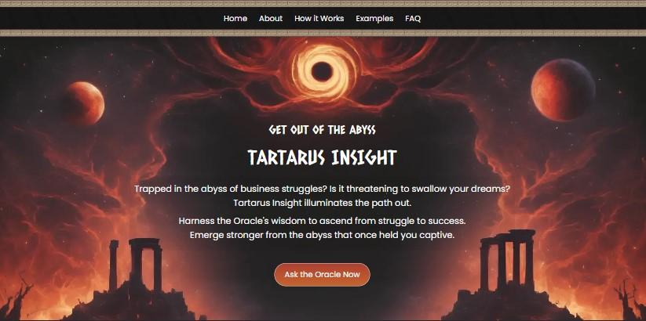

# **Tartarus Insight**  
*Escape the Abyss of Business Struggles with the Wisdom of the Oracle.*  



Tartarus Insight is an open-source fun project aimed at helping entrepreneurs navigate their business challenges through the guidance of an AI Oracle.

---

## A Welcoming Space for Open Source Contributors

This project is more than just an AI chatbot—it's also a friendly playground for developers who want to contribute to open source, regardless of their experience with git and open source contributions.

I've created this space where:
- You can make your first pull request without stress
- Experimentation is encouraged
- Making mistakes is part of the process
- Questions are always welcome

If you're new to open source contributions or still getting comfortable with git workflows, feel free to jump in, try things out, and learn alongside me as we build this project together.

---

## **Features**  
- **Oracle Interaction**: Place your business-related questions to the Oracle and receive actionable insights.
- **AI Support**: Integrated with Ollama and supports OpenAI and Claude models.
- **Future Integrations**: deepseek support planned.  

---

## **Getting Started**
You can explore the project by following these steps:
1. Clone the repository:  
   ```bash  
   git clone https://github.com/paaggeli/tartarus-insight.git
   cd tartarus-insight  
   ```  
2. Open the index.html file in your browser.
   Note: If you want to use Ollama with this application, you'll need to run the web app on a local server

---

## **Contributing**  
We welcome contributions from developers of all levels! Whether you want to improve the UI, enhance AI capabilities, or refine documentation, your help is appreciated.

For detailed contribution guidelines, check out our [CONTRIBUTING.md](https://github.com/paaggeli/tartarus-insight/blob/main/CONTRIBUTING.md) file.

---

## **Contact**  
Have questions or ideas? Reach out:  
- **GitHub Issues**: [Report or Suggest](https://github.com/paaggeli/tartarus-insight/issues)  

---
